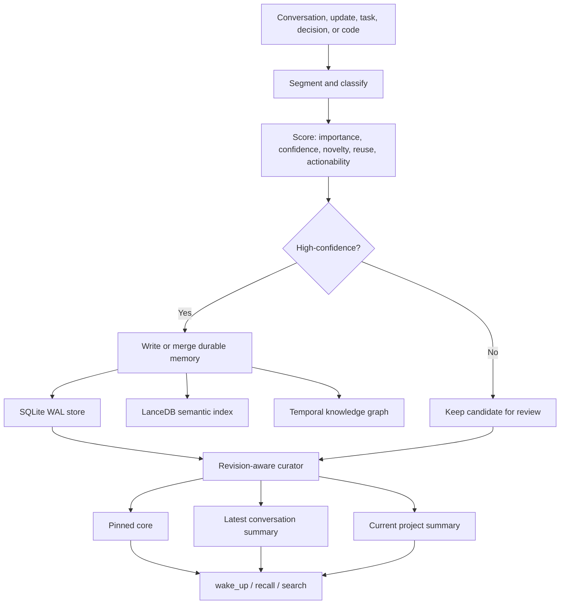

# Memery

**A local-first, continuously curated memory layer for AI agents.**

[](LICENSE)
[](https://www.python.org/)
[](https://modelcontextprotocol.io/)
[](https://github.com/Fintechain/edge-memery/actions/workflows/ci.yml)

Memery turns conversations, project updates, decisions, tasks, code structure, and general life or business matters into durable context that remains useful across sessions. It is exposed as a Model Context Protocol (MCP) server and runs on the edge: the primary database, vector store, summaries, and knowledge graph remain on the local machine.

Memery is not merely a transcript archive. Its central idea is that memory should reorganize itself.

For every context, Memery maintains three protected records at the top of memory:

1. `project_core` - the enduring goals, principles, architecture, or conceptual foundation.
2. `latest_conversation_summary` - a replaceable summary of the latest conversation or update.
3. `project_summary` - the current completed work, open work, constraints, and decisions.

These records are pinned, updated in place, returned before ordinary memories, and protected from pruning or compaction.

## Acknowledgements

Memery is built in gratitude to people and projects that treated memory, knowledge, and human-computer collaboration as serious engineering problems.

- The ancient memory-palace tradition, for the idea that recall improves when knowledge has structure and place.
- Vannevar Bush, Douglas Engelbart, and Ted Nelson, for imagining computers as instruments for extending human thought rather than merely processing data.
- [Graphify](https://github.com/safishamsi/graphify), for demonstrating how source code and documents can become a queryable knowledge graph.
- [MemPalace](https://github.com/MemPalace/mempalace), for its spatial approach to durable AI memory and memory curation.
- [Model Context Protocol](https://modelcontextprotocol.io/docs/getting-started/intro), for providing an open interface between AI applications, tools, and local data.
- SQLite, LanceDB, NetworkX, scikit-learn, and the wider open-source community, whose quiet, dependable work makes local intelligence possible.

Memery borrows ideas, not glory. Any useful originality here stands on foundations laid by others.

## What It Can Remember

Memery is not limited to software projects. A context can be declared or automatically recognized as:

- `software` - architecture, APIs, bugs, deployments, implementation progress.
- `research` - questions, hypotheses, methods, evidence, experiments, next steps.
- `business` - goals, customers, strategy, rules, risks, execution status.
- `learning` - learning goals, knowledge frameworks, mastered topics, remaining work.
- `general` - any long-running matter that needs continuity.
- `auto` - infer the most suitable profile from the stored material.

Ordinary memories can be classified as goals, principles, preferences, facts, events, plans, decisions, architecture, API contracts, bugs, tasks, and other specialized types.

## How It Works



### Ingestion

`ingest_conversation` and `ingest_update` split input into meaningful segments, reject low-value fragments, classify useful statements, and assign a weighted score:

```text
score = importance * 0.30
      + confidence * 0.20
      + novelty * 0.15
      + reusability * 0.20
      + actionability * 0.15
```

Strong candidates are accepted automatically. Uncertain candidates remain available for review instead of being silently promoted to durable truth.

### Self-Maintaining Top-Level Context

The top-level records are singleton memories. Updating them preserves their identity instead of appending an endless sequence of summaries.

- The core is rebuilt from high-value goals, principles, decisions, architecture, preferences, and context description.
- The latest-conversation record is replaced whenever a new conversation is ingested.
- The current summary combines core context, latest conversation, completed work, pending work, and constraints.

A project revision counter invalidates cached summaries only when relevant data changes. Repeated reads and no-op refreshes do not scan the complete memory history.

### Storage and Retrieval

- **SQLite in WAL mode** stores projects, memories, candidates, reviews, tasks, decisions, edges, and temporal triples.
- **One SQLite connection per worker thread** permits concurrent reads and controlled write contention.
- **LanceDB** stores lightweight local semantic vectors.
- **Character n-gram TF-IDF embeddings** provide a zero-API-key default embedding path.
- **Project-prefiltered vector search** prevents cross-project pollution and avoids unnecessary full-database retrieval.
- **Graphify and NetworkX** extract and cluster source-code structure.
- **MemPalace** provides hall routing and an optional secondary palace store.

Graphify and MemPalace are optional integrations. Without them, the core MCP server, SQLite storage, LanceDB retrieval, context summaries, task tracking, decisions, and deterministic hall fallback remain available. Tools that require a missing integration return an installation hint.

## Installation

Python 3.10 or newer is recommended.

Clone the repository and run the following commands from the project directory:

```bash
python -m venv .venv
```

Activate the environment:

```powershell
# Windows PowerShell
.\.venv\Scripts\Activate.ps1
```

```bash
# Linux or macOS
source .venv/bin/activate
```

Install Memery into the active Python environment:

```bash
python -m pip install --upgrade pip
pip install -e .
```

For development:

```bash
pip install -e ".[dev]"
```

Optional integrations are installed explicitly so the core server remains lightweight:

```bash
# Graphify code and document analysis
pip install -e ".[graph]"

# MemPalace routing and temporal knowledge graph integration
pip install -e ".[palace]"

# Both integrations
pip install -e ".[all]"
```

The equivalent dependency list is available in `requirements-optional.txt`. Graphify's distribution name is `graphifyy`; its Python import package remains `graphify`.

Check the installation:

```bash
memery doctor
```

For direct source-tree runs before installation:

```bash
python run_server.py
```

The module entry point is equivalent after installation:

```bash
python -m memory_server
```

### MCP Client Configuration

A typical local MCP configuration looks like this:

```json
{
  "mcpServers": {
    "memery": {
      "command": "/absolute/path/to/python",
      "args": ["-m", "memory_server"]
    }
  }
}
```

Use the Python executable from the environment where Memery was installed:

```text
Windows:   C:\path\to\project\.venv\Scripts\python.exe
macOS/Linux: /path/to/project/.venv/bin/python
```

Install Memery into the same Python environment used by the MCP client. If your client can launch console scripts directly, `memery` also works after installation.

`memery` and `python -m memory_server` run an MCP stdio server. They are meant to be launched by an MCP client. For a human-readable health check, use `memery doctor`.

### Troubleshooting Installation

If `python -m memory_server` reports `No module named memory_server`, install Memery first with `python -m pip install -e .`, or use `python run_server.py` for a direct source-tree run.

If running `memery` in a terminal appears to wait for input, that is normal for an MCP stdio server. Press `Ctrl+C` to stop it, or run `memery doctor` for diagnostics.

If pip prints `WARNING: Ignoring invalid distribution -illow`, the active Python environment has a broken third-party package metadata directory, commonly from an interrupted Pillow install. Memery may still install successfully, but a fresh virtual environment is the cleanest fix.

If startup reports `Dataset already exists` for `memories.lance`, upgrade to the latest Memery source and reinstall. The LanceDB backend opens existing vector tables idempotently on restart.

If Windows reports `WinError 32` while reinstalling `memery-mcp`, close any running `memery` or `python -m memory_server` process first. The installer cannot replace an executable that is still in use.

## Basic Usage

### 1. Create a context

```json
{
  "tool": "create_context",
  "arguments": {
    "name": "edge-memory-research",
    "description": "Investigate durable memory on resource-constrained devices.",
    "context_type": "research"
  }
}
```

Supported context types are `auto`, `software`, `research`, `business`, `learning`, and `general`.

### 2. Ingest an update

```json
{
  "tool": "ingest_update",
  "arguments": {
    "context_name": "edge-memory-research",
    "update_text": "We completed the SQLite concurrency layer. Next, benchmark vector retrieval on ARM devices.",
    "source_type": "research-note"
  }
}
```

This operation updates the latest-conversation summary, extracts durable memories, and refreshes the top-level context.

### 3. Start a new AI session

```json
{
  "tool": "wake_up",
  "arguments": {
    "project_name": "edge-memory-research"
  }
}
```

`wake_up` returns the pinned core, latest conversation, project summary, key rules, recent decisions, and memory statistics.

### 4. Recall context for a task

```json
{
  "tool": "recall_for_task",
  "arguments": {
    "project_name": "edge-memory-research",
    "task": "continue the ARM vector retrieval benchmark",
    "limit": 10
  }
}
```

### 5. Record explicit progress

```json
{
  "tool": "record_task_snapshot",
  "arguments": {
    "project_name": "edge-memory-research",
    "task_name": "ARM benchmark",
    "status": "in_progress",
    "completed": "[\"Prepared the test corpus\", \"Measured SQLite throughput\"]",
    "remaining": "[\"Run vector search on ARM\", \"Compare memory usage\"]",
    "notes": "Keep the benchmark fully local."
  }
}
```

### 6. Write many memories efficiently

Use `write_memories_batch` for imports, migrations, agent checkpoints, and high-throughput workloads. It commits the batch in one SQLite transaction, writes vectors in one batch, and refreshes the summary once.

```json
{
  "tool": "write_memories_batch",
  "arguments": {
    "project_name": "edge-memory-research",
    "memories": "[{\"memory_type\":\"fact\",\"title\":\"Device\",\"content\":\"The target device has 8 GB RAM.\"},{\"memory_type\":\"principle\",\"title\":\"Local-first\",\"content\":\"No external embedding API is allowed.\"}]"
  }
}
```

For repeated individual writes, pass `refresh_summary=false`, then call `refresh_project_summary` once after the group is complete.

## Important MCP Tools

| Area | Tools |
|---|---|
| Context | `create_context`, `create_project`, `wake_up`, `get_top_level_memory`, `get_context_bundle` |
| Ingestion | `ingest_update`, `ingest_conversation`, `extract_memory_candidates`, `review_memory_candidate` |
| Memory | `write_memory`, `write_memories_batch`, `search_memory`, `recall_for_task`, `list_memories` |
| Curation | `refresh_project_summary`, `update_latest_conversation_summary`, `compact_project_memory`, `prune_low_value_memories` |
| Progress | `record_task_snapshot`, `record_decision`, `list_task_snapshots`, `list_decisions` |
| Code graph | `analyze_project_code`, `get_graph_neighbors`, `query_graph_path`, `get_graph_stats` |
| Knowledge graph | `add_knowledge_triple`, `query_entity`, `query_entity_timeline`, `invalidate_triple` |

## Performance Design

The performance path is intentionally different from a naive "write one row, regenerate everything" design.

- Thread-local SQLite connections avoid cross-thread connection failures.
- WAL, `synchronous=NORMAL`, memory-backed temporary storage, a 32 MiB page cache, and memory mapping are enabled.
- Composite indexes cover project, status, type, score, and update time.
- Batch writes use one transaction for as many as 5,000 memories.
- Summary source selection is bounded to 120 high-value or recent memories.
- A project revision counter makes unchanged summary refreshes constant-time cache hits.
- Top-level context is cached in memory and fetched with one indexed database query on a cold read.
- Pinned summaries are not inserted into the semantic vector store because they are retrieved directly.
- LanceDB operations are protected by a reentrant lock, while semantic search uses native project prefiltering.

SQLite remains a single-writer database. Very high concurrent write ratios will produce tail-latency spikes even when no operations fail. Use batch writes for sustained ingestion.

## Benchmarks

The following measurements were produced locally on Windows with Python 3.10 in June 2026. They are implementation benchmarks, not universal hardware claims. Results vary with CPU, storage, Python build, database size, and workload.

### Combined Stress Run

Parameters:

```powershell
python benchmarks\benchmark_stress.py `
  --memories 30000 `
  --batch-size 1000 `
  --operations 30000 `
  --workers 128 `
  --write-percent 1 `
  --summary-iterations 1000 `
  --hot-reads 100000 `
  --real-vector-items 10000 `
  --vector-searches 500
```

`--write-percent 1` means one write per ten mixed operations, or a 10% write workload.

| Workload | Throughput | P50 | P95 | P99 | Errors |
|---|---:|---:|---:|---:|---:|
| Batch SQLite insert, 30,000 memories | 16,792.6 ops/s | 54.35 ms/batch | 79.80 ms/batch | 86.47 ms/batch | 0 |
| Unchanged summary refresh, 1,000 calls | 46,989.2 ops/s | 0.018 ms | 0.029 ms | 0.041 ms | 0 |
| Cached top-level read, 100,000 calls | 79,402.0 ops/s | 0.010 ms | 0.017 ms | 0.027 ms | 0 |
| Mixed SQLite workload, 128 workers, 10% writes | 511.0 ops/s | 259.82 ms | 382.01 ms | 1,246.79 ms | 0 |
| Real vector batch insert, 10,000 vectors | 13,318.9 ops/s | - | - | - | 0 |
| Real vector search over 10,000 vectors | 48.2 searches/s | 20.52 ms | 23.96 ms | 26.38 ms | 0 |

### Optimization Progress

The initial implementation used one shared SQLite connection and failed all 1,000 operations in a 16-thread mixed test. After thread-local connections, WAL tuning, bounded summaries, revision-aware caching, and query redesign, stress runs completed with zero errors.

Notable improvements measured with the same 20,000-memory workload:

- Top-level reads: approximately `126` to `68,911+ ops/s` after caching.
- Summary refreshes: approximately `36.8` to `48,000+ ops/s` when unchanged.
- Mixed 32-thread throughput: approximately `553` to `684-699 ops/s`.
- Vector search P95: approximately `39 ms` to `21.8-24 ms` after native project prefiltering.

### LanceDB Index Note

The installed LanceDB version was also tested with IVF-PQ index construction. Its Rust KMeans path panicked on the local 10,000-vector test corpus, so Memery deliberately does **not** enable that unstable index automatically. Flat vector search with native project prefiltering is currently the safer default. Re-evaluate ANN indexing after upgrading LanceDB and rerunning the benchmark suite.

## Running the Test Suite

```powershell
$env:PYTEST_DISABLE_PLUGIN_AUTOLOAD = "1"
python -m pytest -q
Remove-Item Env:PYTEST_DISABLE_PLUGIN_AUTOLOAD
```

Current result:

```text
10 passed
```

Run a smaller core-only benchmark:

```powershell
python benchmarks\benchmark_stress.py `
  --memories 20000 `
  --operations 20000 `
  --workers 32
```

## Configuration

Configuration is loaded in this order:

1. Environment variables.
2. `~/.memery/config.json`.
3. Built-in defaults.

Useful variables:

| Variable | Purpose |
|---|---|
| `MEMERY_DATA_DIR` | Memery data directory |
| `MEMERY_DB_PATH` | SQLite database path |
| `MEMERY_VECTOR_BACKEND` | Vector backend, currently `lancedb` |
| `MEMERY_EMBEDDING_DIM` | Embedding dimension |
| `MEMERY_PALACE_VECTOR_ENABLED` | Enable the optional MemPalace/Chroma secondary vector write path |

The secondary MemPalace vector path is disabled by default because its Chroma/ONNX dependency chain can be unstable on some Windows installations. The primary SQLite and LanceDB paths remain fully functional.

## Data Layout

Default local paths:

```text
~/.memery/memory.db                  SQLite memory and graph metadata
~/.memery/data/lancedb_data/         Semantic vector data
~/.memery/data/palace/               Temporal knowledge graph and optional palace data
~/.memery/cache/                     Runtime cache
~/.memery/config.json                User configuration
```

Back up the complete `~/.memery` directory when preserving an installation.

Older source-tree installations may contain `memory.db`, `lancedb_data`, or `memery_data` inside the repository. These paths are now ignored by Git. Move the data into `~/.memery`, or keep using it explicitly through `MEMERY_DB_PATH` and `MEMERY_DATA_DIR`.

## Repository Layout

```text
backends/                  Vector backend implementations
benchmarks/                Local stress benchmark scripts
palace/                    MemPalace routing and temporal graph adapter
pipeline/                  Graphify code-analysis pipeline
tests/                     Regression and smoke tests
config.py                  Configuration and runtime paths
curator.py                 Ingestion, scoring, summaries, compaction, and pruning
db.py                      SQLite schema and persistence layer
server.py                  MCP tools and server entry point
pyproject.toml             Packaging, dependencies, and console command
```

## Design Principles

1. **Local-first:** useful memory should not require a hosted API.
2. **Continuity over transcripts:** preserve the current meaning of a matter, not only its chronology.
3. **Explicit uncertainty:** inferred and ambiguous memories should not masquerade as extracted fact.
4. **Stable identity:** summaries are updated in place instead of multiplied.
5. **Bounded recall:** the most important context belongs at the top; deeper history remains searchable.
6. **Performance is correctness:** a memory system that cannot survive sustained use will eventually be bypassed.
7. **No false speed:** benchmark SQLite and vector retrieval separately, report tail latency, and keep errors visible.

## Current Limitations

- SQLite has one writer; batch ingestion is strongly preferred under heavy write load.
- The default TF-IDF vectors are lightweight and local, but they are not a replacement for a strong multilingual embedding model in every domain.
- Summary extraction is deterministic and heuristic. It avoids API dependencies, but it may require explicit task snapshots or decisions for the best results.
- Graphify and MemPalace are external dependencies whose behavior can change between releases.
- Automatic ANN indexing is intentionally disabled until the installed LanceDB index builder proves stable under the included stress suite.

## Contributing and Security

Contributions are welcome. Read [CONTRIBUTING.md](CONTRIBUTING.md) before opening a pull request and follow the [Code of Conduct](CODE_OF_CONDUCT.md).

Report vulnerabilities privately according to [SECURITY.md](SECURITY.md). Never attach real memory databases, secrets, or personal records to a public issue.

## License and Disclaimer

Memery is licensed under the [Apache License 2.0](LICENSE). The license permits commercial use, modification, distribution, private use, and patent use subject to its conditions, including preservation of license notices and identification of modified files.

The software is distributed on an **"AS IS"** basis, without warranties or conditions of any kind. See Sections 7 and 8 of the license and the plain-language [DISCLAIMER.md](DISCLAIMER.md). Third-party dependencies remain governed by their own licenses.

## Philosophy

An AI assistant should not begin every conversation as a brilliant stranger.

Memery tries to give it continuity without surrendering ownership of memory to a remote service. The durable core stays visible. The latest conversation stays current. Completed work remains completed. Open work remains open. History is retained, but history does not get to bury the present.
